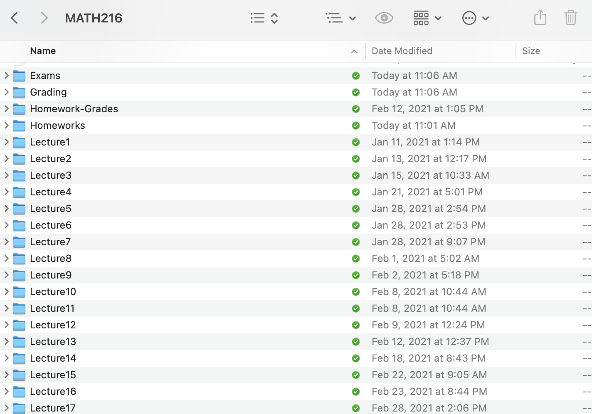
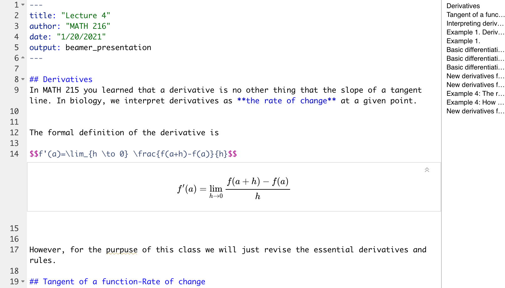

## Useful advice

- Your closest collaborator is you six months ago, and you do not reply to emails -*Karl Broman*

- The most important tool is the mindset, when starting, that the end product will be reproducible -*Keith Baggerly*

- Assume that everything that you are doing right now will need to be redone at some point in the future: be prepared

## Five stages of reproducibility

(From Claudia Solis-Lemus PhD)

1. Denial: I do not need to be reproducible. I have not kept track of code/scripts in years and I have been just fine. People exagerate. We do not have to be that paranoid

2. Anger: Why do I have to write these stupid notes!? It takes twice the time to write notes and do the work. I could simply do the work! This is stupid and ridiculous! I am just wasting my time with notes and comments that nobody cares about!

3. Bargaining: Well, perhaps it is ok if I only keep notes in the very final script or the very final function. That makes sense. No one needs to know or would even care to read my other code. Yes, maybe it is ok if I only comment at the end on the project

## Five stages of reproducibility

(From Claudia Solis-Lemus PhD)

4. Depression: I do not understand my notes. The comments that I made a year ago do not mean anything to me anymore. This has totally failed. I am a reproducibility failure. If I am not able to understand my own notes, no one will

5. Acceptance: I understand that being reproducible is a process. No one does this right the first time. No one does it right period. We are all learning, and all I can do is try my best to make notes/comments and be honest and open about my research process

## Basic organizational skills- Directories

{width=74%}

## Basic organizational skills- Directories

## Tracking everything you do with Rmarkdown

For example, I like it for my class and tutorials because it can write math

## Tracking everything you do with Rmarkdown

It can also accumulate all your code

## To git or not to git

- Personally: I don't have a preference. I think you can be as organized as possible in folders as long as you comment your code

- If you don't use git as often, use dropbox- $10 a month (I don't think about backups)

## The basic data vs. the data transform

## The datatransform.R file

